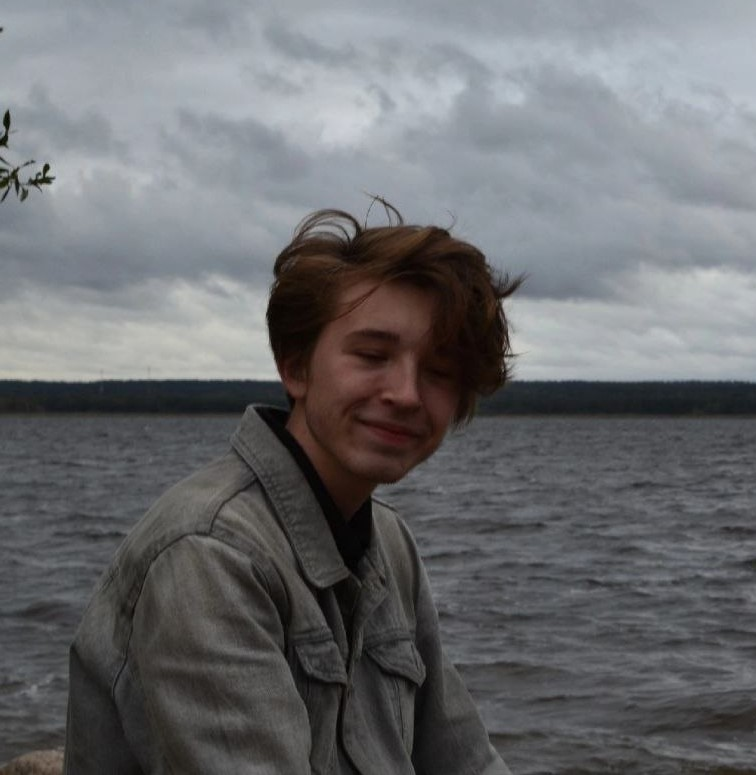

# Aleksandr Muchin

## My contacts
  * **Email**: itertiomodo@gmail.com
   * **Tel**: +79522704908
   * **Telegram**: @tertiomodo
   * **Discord**: @tertiomodo 
*****
## Brief information about yourself
My goal is to become a developer and work in a large IT company, come up with and implement interesting projects and ideas, as well as learn new things and constantly replenish my knowledge base. 

My strengths are perseverance, accuracy, purposefulness, perseverance.
*****
## Skills
* Basic skills:
  * Html
  * CSS
  * Git

## Code examples
```
let x=2, y=2;
c=x*y;
console.log (c);
```
*****
This CV is my first project
Ссылка на CV 

## Education
Mainly self-study and video courses on youtube

I speak English at level A1